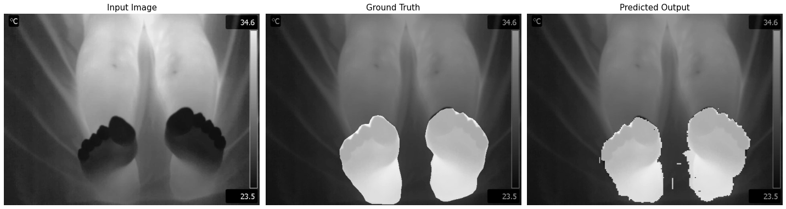
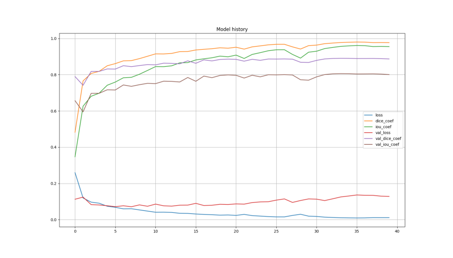
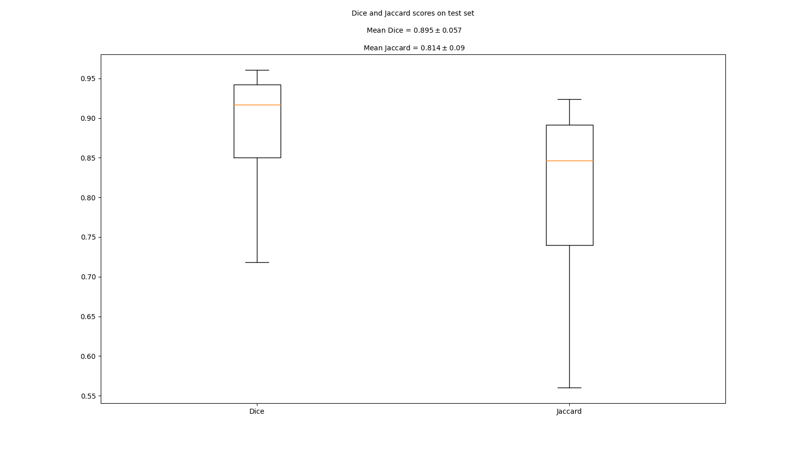
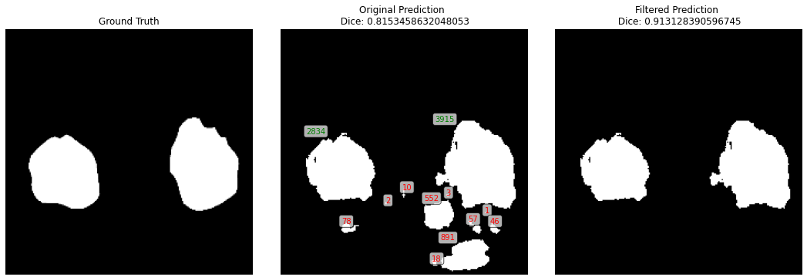

# Feet U-Net

Semantic segmentation of thermal feet images for characterizing epidural anesthesia performance during birth using a modified U-Net neural network.



## Google Colab demo: [](https://colab.research.google.com/drive/1QGY1psKXsUyWZUVVVOPMfwFSE6_Q3EZA?usp=sharing)

## GUI project: https://github.com/blotero/FEET-GUI

## Dataset

The used dataset contains images from 22 different patients. Each patient has between 6 and 18 images. There are 196 thermographic images in total, from which 157 were used to train the model and 39 to test it.

## Results

### Training History



### Dice and Jaccard scores on the test set:




### Additional metrics:

| Segmentation            | Dice               | Jaccard (IoU)      | Specificity        | Sensitivity        | Precision          |
|-------------------------|--------------------|--------------------|--------------------|--------------------|--------------------|
| U-Net                   | $$89.33 \pm 6.07$$ | $$81.24 \pm 9.46$$ | $$98.15 \pm 1.83$$ | $$90.65 \pm 6.09$$ | $$88.93 \pm 9.73$$ |
| U-Net + Post-processing | $$89.96 \pm 5.77$$ | $$82.22 \pm 9.0$$  | $$98.41 \pm 1.56$$ | $$90.53 \pm 6.19$$ | $$90.16 \pm 8.88$$ |

The Post-processing step is explained down below in Predict section.

### Confusion Matrix

This confusion matrix was built using all the images of the test set.


## Usage

### 1. Clone the repository

```bash
$ git clone https://github.com/Rmejiaz/Feet_U-Net
```

### 2. Install the requirements

```bash
$ pip install -r requirements.txt
```

From now on, it is easier to work directly on the directory `U-Net`:

```bash
$ cd U-Net
```
### 3. Download the dataset

It is possible to download the [feet dataset](https://drive.google.com/drive/folders/16nbmFG2MucF6UlY05rPajx4G81vttg4O?usp=sharing) in google colab, kaggle, or a linux machine executing the script `download_dataset.py` as follows:

```bash
$ python download_dataset.py --path=DOWNLOAD PATH
```
The download path is relative to the current directory, if left unspecified it will download the dataset to the current working direcory.

### (Optional) Data Augmentation

It is possible to do data augmentation to the images and the masks using the script `augmentation.py`. It applies some random transformations to the input images such as rotations, crops and shiftings.

```bash
$ python augmentation.py --img_path=PATH TO IMAGES DIRECTORY --masks_path=PATH TO MASKS DIRECTORY --augmented_path=PATH TO SAVE THE NEW DATASET --labels=PATH OF THE LABELMAP n_images=NUMBER OF IMAGES TO GENERATE 
```

It will automatically create a new dataset in the specified path. If left unspecified, it creates the new dataset in the current working directory. By default, `img_path = ./Dataset_Unificado/Train/Processed_Images` , `masks_path = ./Dataset_Unificado/Train/BinaryMasks` , `labels = ./Dataset_Unificado/binary_labelmap.txt` and `n_images = 192`  

(It is advided to be used with caution, as results do not necessarily improve when a large number of images are generated)

### 4. Train 

In order to train the model, run the following command:

```bash
$ python train.py --imgs_path=PATH TO IMAGES DIRECTORY --masks_path=PATH TO MASKS DIRECTORY --val_imgs=PATH TO THE IMAGES FOR VALIDATION --val_masks=PATH TO THE MASKS FOR VALIDATION --val_split=VALIDATION SPLIT --weights=PATH TO SAVE THE TRAINED WEIGHTS --buffer_size=BUFFER_SIZE --batch_size=BATCH SIZE --epochs=NUMBER OF EPOCHOS --save_freq=SAVE FREQUENCY FOR THE CHECKPOINTS --save_model=PATH TO SAVE THE MODEL (.h5 FORMAT)
```

If `val_split` is set to `0`, `val_imgs` and `val_masks` will be used for validation. Otherwise, it will split the training dataset according to `val_split` and use it for validation.

The defaults are: `imgs_path=./Dataset_CVAT2/JPEGImages/Train` , `masks_path=./Dataset_CVAT2/SegmentationClass/Train` `val_imgs = ./Dataset_CVAT2/JPEGImages/Test` , `val_masks = ./Dataset_CVAT2/SegmentationClass/Test` , `weights = ./weights/` , `buffer_size = 100` , `batch_size = 5` , `epochs = 10` , `save_freq = 5` 

The weights will be saved to `weights` and the training history will also be saved in `./results/history0`. The complete model will be saved in the specified directory in `save_model`. By default it will be saved to `./results/Model.h5`

### 5. Predict

Do a prediction using trained weights or model.

```bash
$ python predict.py --image_path=IMAGE PATH --mask_path=MASK PATH --labels=LABELS PATH --show_results=True --model_path=WEIGHTS OR MODEL PATH --clean_prediction=WHETER TO CLEAN THE PREDICITON OR NOT
```
The defaults for the different arguments are the same ones as used before

It is possible to make a prediction using weights or directly a model in .h5 format. By default, `model_path` is set to `./results/Model.h5` (both .h5 and .ckpt formats are supported)

By default, the prediction is passed through a post-processing process, which removes all objects with sized below a defined threshold. This is done using the `cv2` function `connectedComponentsWithStats`. It is also possible to obtain the pure prediction by setting `clean_prediction` to `False`



### 6. Evaluate

Make a prediction for a test set and measure dice and jaccard scores

```bash
$ python evaluate.py --model_path=MODEL PATH --test_images=IMAGES DIRECTORY PATH --test_masks=MASKS DIRECTORY PATH --results=PATH TO SAVE THE RESULTS
```

By default, `test_images` and `test_masks` are set to `./Dataset_CVAT2/JPEGImages/Test` and `./Dataset_CVAT2/SegmentationClass/Test`. and restuls to `./restults/`. `model_path` supports both `.ckpt` files (weights) and `.h5` complete trained model. 

After running the script, a figure containing the Dice and Jaccard scores boxplot for the test images is generated and saved in `results`, as well as a subdirectory containing the predictions of the test set. 


### Download and use a pre-trained model

Download link: https://drive.google.com/file/d/1S-pUZZONC3fqMSvXfBg_7tGdxtkLIs-F/view?usp=sharing

It is also possible to download a pretrained model, which can be later used to make predictions as follows:

```python
model = tf.keras.models.load_model('Model1.h5')

Y_pred = model.predict(X)
```
Or using `predict.py`, as shown before.

This model achieved very similar results to those shown on the [Results](#Results)

## TO DO

### Segmentation:

- ~~U-Net implementation to segment feet and background.~~
- U-Net implementation to segment the differentes parts of the foot.
- Create a toy dataset to compare the performance.
- ~~Data augmentation~~
- ~~Re-label the dataset (optional)~~
- ~~Improve Dice to at least 80%.~~
- ~~Closing and Opening~~
